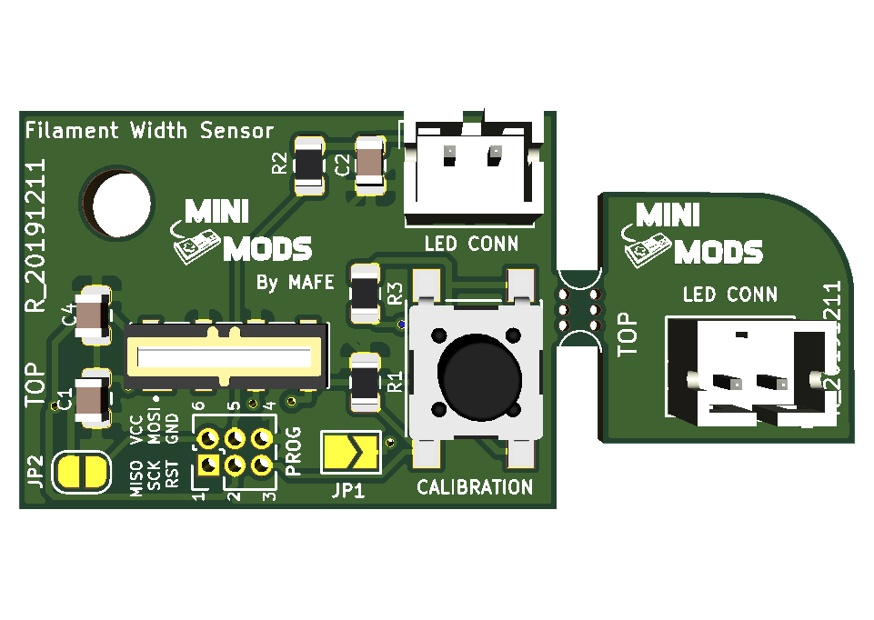
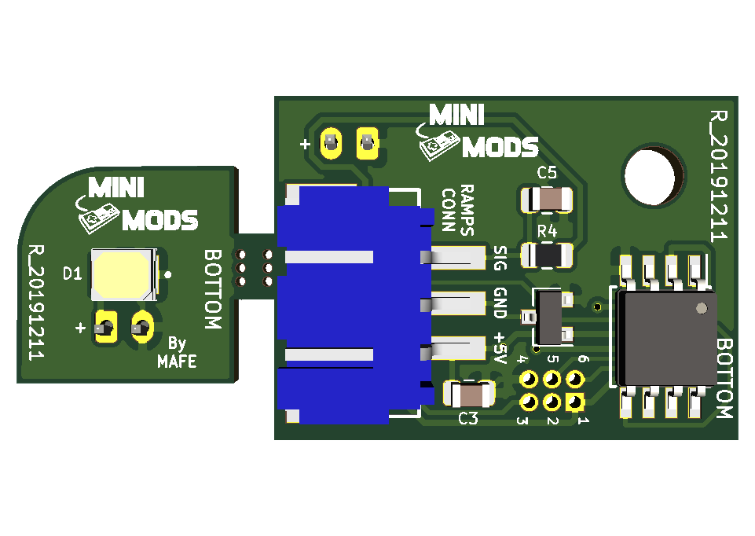

# 3D Printer Filament Width Sensor

This is an optical sensor based on the ATtiny85 - 8-bit AVR Microcontrollerthat measures the plastic filament width in real time as it goes into a 3D printer extruder by using the TSL1401CL sensor.

License
-------

 

This project is licensed under the Attribution-NonCommercial-ShareAlike CC BY-NC-SA 4.0 license. The full legal text of the license may be found in the LICENSE.md file in this repository. For more information about this license, please visit 
the Creative Commons Foundation (https://creativecommons.org/licenses/by-nc-sa/4.0/).

Features
--------
* Measures filament width in real time to improve extrusion.

* Can detect filament diameter of 1.75mm, 2.85mm and 3.00mm.

* Compatible with Marlin 1.1.X, RepRap and MK4duo Firmware.

* Can interface with a variety of 3D Printer Controller Board including:
	- RAMPS 1.2 and newer
	- RAMBo 1.2 and newer
	- Printrboard Rev B,C,D,E

* One button calibration mode.

* Compact PCB design (25.71mm x 19.00mm)

* Operational Voltage: 5V

* Reverse polarity protection.

* Programming pins for future firmware upgrade.

* You can buy the latest version of this board fully assembled from [http://mini-mods.com](http://mini-mods.com)

----------
* Filament Width Sensor Top.

* Filament Width Sensor Bottom.

----------

Prerequisites
---------------------
1. Access to the source code for your existing printer.

2. Arduino IDE 1.8 or newer.

Software Configuration
---------------------
Modify Configuration.h and set the appropriate filament with diameter, in this example 1.75mm filament is configured.

		#define DEFAULT_NOMINAL_FILAMENT_DIA 1.75 
			
Modify Configuration_adv.h on the section Filament Width Sensor, enabled by uncomment the following line.

		#define FILAMENT_WIDTH_SENSOR
			
Also to constantly display the nominal filament width on your 3D printer display, uncoment the following line.

		#define FILAMENT_LCD_DISPLAY 
		
Once done, flash the modified firmware to your printer.
			
Hardware Installation
---------------------
The following images display the correct pin location for the installation for the Filament Width Sensor.

* RAMPS 1.4 Pinout.

* RAMBo 1.2 Pinout.

* Printrboard Rev B,C,D,E Pinout.

Basic Hardware Usage
--------------------
The calibration button is used to calibrate the sensor. This will be needed for first time use or if the sensor is modified (different housing, LED, etc). 

Press the calibration button while the filament is inside in the encloser to calibrate. 

Hold the button for roughly 3 seconds, until the LED lights off or flashes again. The sensor is then calibrated and settings will be saved in the flash. If you press calibration without a filament inserted, you will get false readings.

Basic Software Usage
--------------------
This is the list of gcodes you can use to enable the Filament Width Sensor on your slicer:

M404	Enter the nominal filament width (3mm, 1.75mm) or will display nominal filament width without parameters.

	Examples:
				M404 ; Will display real time filament width
				M404 N1.75	; Set the nominal filament width to 1.75mm
				
M405	Turn ON Filament Sensor extrusion control. Optional D<delay in cm> to set delay in centimeters between sensor and extruder. Always start your slicer code with this gcode.

	Examples:
				M405 ; Turn on Filament Sensor extrusion control
				M405 D12 ; Turn on Filament Sensor extrusion control and set a delay of 12cm between the sensor reading and the extruder.
				
M406	Turn off Filament Sensor extrusion control. Always end your slicer code with this gcode. 

M407	Displays measured filament diameter. In RepRapFirmware, M407 does the same as M404. 

Basic Maintenance
-----------------
This is an optical sensor and dust or debris can cause false or changing readings. Clean dust by blowing on the sensor or gently using a cotton swab to clean the sensor.
